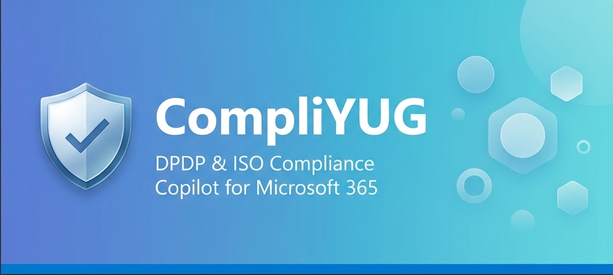
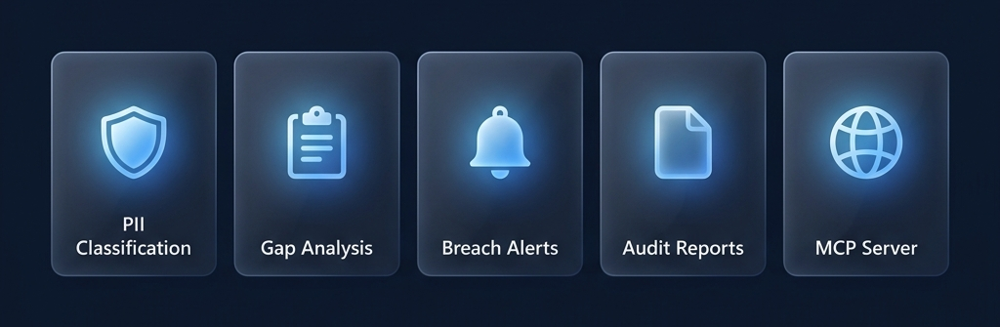
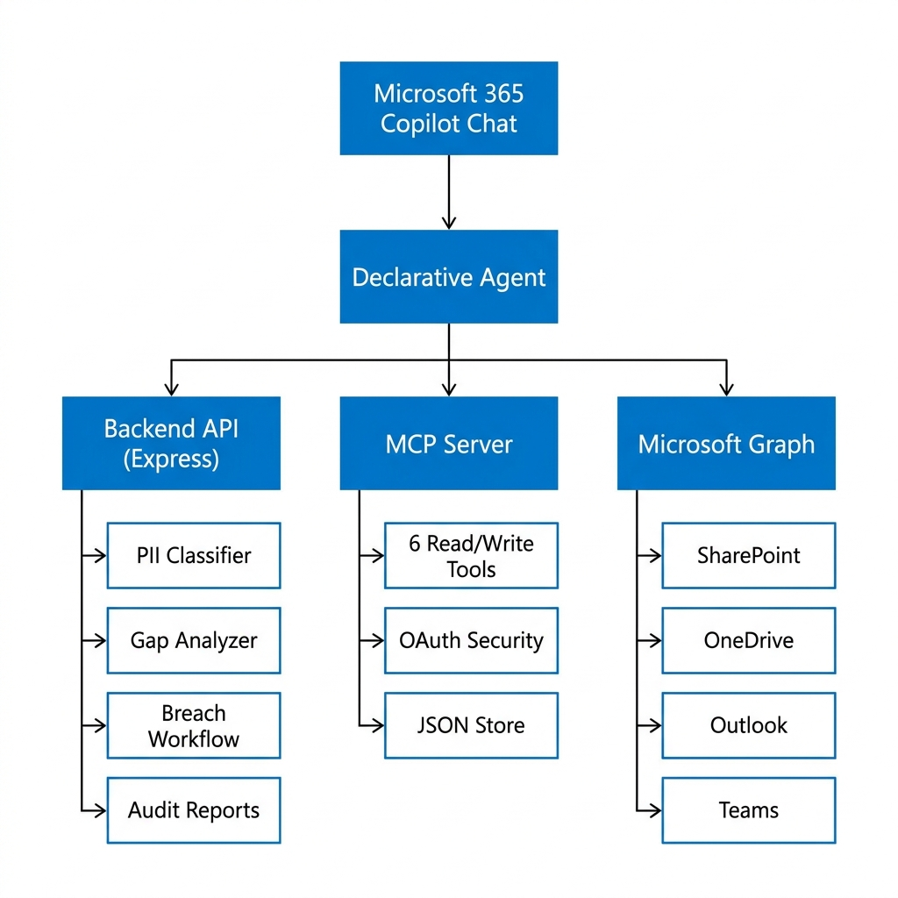

# CompliYUG — DPDP Act & ISO Compliance Copilot Agent



**Track: Battle #3 — Enterprise Agents for Microsoft 365 Copilot**

An enterprise compliance agent that monitors Microsoft 365 content for DPDP Act 2023 and ISO/IEC 27001:2022 risks. Built as a **Declarative Agent** in M365 Copilot Chat, backed by a live Node.js compliance engine and an **MCP Server** for persistent compliance data operations.



### 👤 Built by [Fenil Chauhan](https://www.linkedin.com/in/itfenil/)

> **GRC Professional · Certified Data Protection Officer · Data Auditor**
>
> CompliYUG is not just a hackathon prototype — it is built by a practising compliance professional who audits enterprises for a living. Fenil brings real-world regulatory expertise as a **Certified Lead Auditor** across multiple international management system standards:
>
> | Certification | Standard |
> |---|---|
> | 🛡️ Lead Auditor | **ISO/IEC 27001:2022** — Information Security Management Systems (ISMS) |
> | 🔐 Lead Auditor | **ISO/IEC 27701:2025** — Privacy Information Management Systems (PIMS) |
> | 📋 Lead Auditor | **ISO 9001:2015** — Quality Management Systems |
> | ⚙️ Lead Auditor | **ISO/IEC 20000-1:2018** — IT Service Management Systems |
> | 📜 Certified | **Data Protection Officer (DPO)** |
> | 🔍 Certified | **Data Auditor** |
>
> This domain expertise directly shaped CompliYUG's 47 ISO control mappings, 17 DPDP Act requirement checks, and the 72-hour breach notification workflow — ensuring the agent reflects how compliance actually works in the field, not just in theory.

---

## What This Agent Does

| Capability | How |
|---|---|
| **PII Classification** | Detects Aadhaar, PAN, credit card, passport, IFSC, GSTIN, phone, email in M365 content |
| **Policy Gap Analysis** | Scores policy text against 47 ISO 27001:2022 Annex A controls + 17 DPDP Act requirements |
| **Breach Notification** | 72-hour DPDP Act Section 40 workflow — calculates deadline, generates board alert, Teams dispatch |
| **Audit Report** | Executive summary + ISO/DPDP compliance tables + recommendations, downloadable as CSV |
| **Live Dashboard** | Risk KPIs, framework progress bars, activity feed at `http://localhost:3000/` |
| **M365 Content Search** | Searches SharePoint, OneDrive, Outlook via Microsoft Graph for compliance evidence |
| **Teams Alerts** | Rich MessageCard alerts for breach events, high-risk scans, and restricted data classification |
| **MCP Compliance Server** | 6 read/write tools for compliance policies, findings, breaches, regulatory updates, audit trail |
| **OAuth Security** | Microsoft Entra ID token validation on all API endpoints |

---

## Architecture



```
Microsoft 365 Copilot Chat
        │
        │  Declarative Agent (appPackage/)
        │  ├── EmbeddedKnowledge  — DPDP Act + ISO 27001 text files
        │  ├── OneDriveAndSharePoint  — Work IQ: searches user's M365 content
        │  └── Actions → apiPlugin.json
        │                  ├── openapi.yaml → Backend API (5 functions)
        │                  └── mcp-openapi.yaml → MCP Server API (6 functions)
        │                        │                          │
        │                        ▼                          ▼
        │            CompliYUG Backend            CompliYUG MCP Server
        │            (Express / Node 24)          (MCP SDK + Express)
        │            Port 3000                    Port 3001
        │            ├── POST /api/classify       ├── SSE /sse (MCP transport)
        │            ├── POST /api/gap-analysis   ├── GET  /api/mcp/policies
        │            ├── POST /api/breach/notify  ├── POST /api/mcp/findings
        │            ├── GET  /api/audit-report   ├── GET  /api/mcp/status
        │            ├── GET  /api/dashboard      ├── GET  /api/mcp/regulatory-updates
        │            └── POST /api/scan           ├── POST /api/mcp/breaches
        │                     │                   └── GET  /api/mcp/audit-trail
        │           ┌─────────┴─────────┐
        │           ▼                   ▼
        │  Microsoft Graph API    Azure AI Foundry
        │  SharePoint / Mail      Risk scoring (Foundry IQ)
        │  OneDrive / Teams
        │
        └── Teams Incoming Webhook → Compliance channel alerts
```

---

## Microsoft IQ Integration

| IQ Layer | Where |
|---|---|
| **Work IQ** | `OneDriveAndSharePoint` capability in `declarativeAgent.json` — agent searches the user's M365 content (SharePoint, OneDrive, Outlook) directly from Copilot Chat |
| **Foundry IQ** | `backend/src/services/foundry.js` — risk scoring routed through Azure AI Foundry endpoint; falls back to local keyword scoring when `FOUNDRY_RUN_URL` is not set |

---

## MCP Server Integration

The MCP Server (`mcp-server/`) implements the **Model Context Protocol** with both SSE transport and REST API bridge:

### MCP Tools (Read + Write)

| Tool | Type | Description |
|---|---|---|
| `read_compliance_policies` | Read | DPDP Act requirements + ISO 27001 controls |
| `write_compliance_finding` | Write | Record compliance violations with severity and remediation |
| `read_compliance_status` | Read | Compliance posture: health score, open findings, breaches |
| `read_regulatory_updates` | Read | Latest DPDP/ISO regulatory guidance with impact levels |
| `write_breach_record` | Write | Create breach records with 72-hour deadline calculation |
| `read_audit_trail` | Read | Chronological log of all MCP operations |

### OAuth Security

The MCP Server uses **Microsoft Entra ID** OAuth 2.0 for authentication:
- Bearer token validation via JWKS (automatic key rotation)
- Audience + issuer + expiry enforcement
- Graceful dev-mode fallback when Entra config is not set

---

## Security Features

| Feature | Implementation |
|---|---|
| **Authentication** | Microsoft Entra ID token validation middleware |
| **CORS** | Whitelist: Teams, Copilot, localhost only |
| **Rate Limiting** | 60 requests/minute per IP with headers |
| **Security Headers** | X-Content-Type-Options, X-Frame-Options, HSTS, X-XSS-Protection |
| **Responsible AI** | Input sanitisation, prompt injection detection, PII redaction in logs, AI transparency headers |
| **Secret Management** | `.env` files in `.gitignore`, Azure Key Vault recommended for production |
| **PII Masking** | All API responses mask detected PII values |
| **Input Validation** | All API routes validate required fields |

---

## Project Structure

```
├── appPackage/
│   ├── manifest.json              Teams app manifest (v1.28)
│   ├── declarativeAgent.json      DA definition (capabilities + actions)
│   ├── apiPlugin.json             API plugin (11 functions, OAuth auth)
│   ├── openapi.yaml               Backend API spec (5 endpoints)
│   ├── mcp-openapi.yaml           MCP Server API spec (6 endpoints)
│   ├── instruction.txt            Agent response rules and action routing
│   ├── color.png / outline.png    App icons
│   └── knowledge/
│       ├── dpdp-act-2023.txt      DPDP Act 2023 full text
│       ├── iso-iec-27001-2022.txt ISO/IEC 27001:2022 Annex A controls
│       └── dpdp-compliance-workflows.txt  Breach workflow rules
│
├── backend/
│   ├── src/
│   │   ├── index.js               Express entry point (CORS, security, middleware)
│   │   ├── config.js              Environment variable loader
│   │   ├── store.js               In-memory activity store
│   │   ├── routes/
│   │   │   └── compliance.js      All API routes
│   │   ├── services/
│   │   │   ├── classifier.js      PII detection (8 Indian identifier patterns)
│   │   │   ├── gapAnalyzer.js     47 ISO + 17 DPDP controls with remediation
│   │   │   ├── auditReport.js     JSON + CSV audit report generator
│   │   │   ├── foundry.js         Azure AI Foundry risk scoring adapter
│   │   │   ├── graph.js           Microsoft Graph API (mail + drive search)
│   │   │   ├── teams.js           Teams MessageCard alert builder
│   │   │   └── workflows.js       DPDP breach artifact generator
│   │   └── middleware/
│   │       ├── auth.js            Microsoft Entra ID token validation
│   │       ├── rateLimit.js       IP-based rate limiting (60/min)
│   │       └── responsibleAI.js   Content safety guardrails
│   ├── tests/
│   │   ├── classifier.test.js     PII classifier unit tests (15 tests)
│   │   └── gapAnalyzer.test.js    Gap analyzer unit tests (8 tests)
│   ├── public/
│   │   ├── index.html             5-tab compliance dashboard
│   │   ├── style.css              Dashboard styles
│   │   └── app.js                 Dashboard logic
│   ├── package.json
│   └── .env.example
│
├── mcp-server/
│   ├── src/
│   │   ├── index.js               MCP server (SSE transport + REST bridge)
│   │   ├── tools.js               6 MCP tool definitions
│   │   ├── store.js               Persistent JSON file store
│   │   ├── routes.js              REST API bridge for OpenAPI plugin
│   │   └── auth.js                Entra ID OAuth JWT validation
│   ├── package.json
│   └── .env.example
│
├── teamsapp.yml                   ATK provisioning + deployment config
├── teamsapp.local.yml             ATK local F5 debugging config
├── env/
│   └── .env.dev                   ATK environment variables
└── README.md
```

---

## Quick Start — Local Demo

### 1. Backend

```bash
cd backend
npm install
copy .env.example .env     # Windows
# Set ENTRA_AUTH_DISABLED=true for local dev (already set in .env.example)
# Fill in TEAMS_WEBHOOK_URL for alert demos
npm start
```

Dashboard opens at: **http://localhost:3000/**

### 2. MCP Server

```bash
cd mcp-server
npm install
copy .env.example .env     # Windows
npm start
```

MCP Server runs at: **http://localhost:3001/**
- SSE endpoint: `http://localhost:3001/sse`
- REST API: `http://localhost:3001/api/mcp/*`
- Health: `http://localhost:3001/health`

### 3. Run Tests

```bash
cd backend
npm test
```

Expected: 23 tests pass (15 classifier + 8 gap analyzer)

### 4. Test the APIs

**Classify a document:**
```powershell
Invoke-RestMethod -Method Post -Uri http://localhost:3000/api/classify `
  -ContentType "application/json" `
  -Body @'
{
  "text": "Employee Ramesh Kumar, Aadhaar: 1234 5678 9012, PAN: ABCDE1234F, salary data and medical records.",
  "source": "HR SharePoint",
  "sendTeamsAlert": true
}
'@
```

**Run gap analysis:**
```powershell
Invoke-RestMethod -Method Post -Uri http://localhost:3000/api/gap-analysis `
  -ContentType "application/json" `
  -Body @'
{
  "policyText": "We enforce MFA via Azure Entra ID. AES-256 encryption via Azure Key Vault. SIEM logging with Sentinel. Incident response plan aligned to ISO 27001. Data retention policy documented. Backup and DR tested quarterly.",
  "sendTeamsAlert": true
}
'@
```

**Read compliance policies via MCP REST API:**
```powershell
Invoke-RestMethod -Method Get -Uri "http://localhost:3001/api/mcp/policies?framework=dpdp"
```

**Record a compliance finding via MCP:**
```powershell
Invoke-RestMethod -Method Post -Uri http://localhost:3001/api/mcp/findings `
  -ContentType "application/json" `
  -Body @'
{
  "title": "Missing encryption on HR database",
  "severity": "critical",
  "framework": "Both",
  "controlId": "A.8.24",
  "affectedAsset": "Azure SQL — HR schema",
  "remediationPlan": "Enable TDE and column-level encryption within 7 days"
}
'@
```

**Check compliance status:**
```powershell
Invoke-RestMethod -Method Get -Uri http://localhost:3001/api/mcp/status
```

**Get regulatory updates:**
```powershell
Invoke-RestMethod -Method Get -Uri "http://localhost:3001/api/mcp/regulatory-updates?impactLevel=high"
```

### 5. Copilot Chat Agent (sideloading)

1. Open VS Code with the Microsoft 365 Agents Toolkit extension
2. Sign in to your M365 tenant
3. Press **F5** to sideload the app from `appPackage/`
4. Open **Microsoft 365 Copilot Chat** and find the agent
5. Try: *"Classify this content for DPDP compliance: [paste any text]"*

> **For the API plugin actions to work in Copilot Chat**, the backend and MCP server must be deployed to Azure and the server URLs in `openapi.yaml` and `mcp-openapi.yaml` must point to the live deployments. Local development uses the embedded knowledge + OneDriveAndSharePoint capabilities only.

---

## Environment Variables

### Backend (`backend/.env`)

| Variable | Required | Description |
|---|---|---|
| `PORT` | Optional | Backend port (default: 3000) |
| `ENTRA_AUTH_DISABLED` | Dev only | Set `true` to skip auth in local dev |
| `TEAMS_WEBHOOK_URL` | For alerts | Teams Incoming Webhook URL |
| `GRAPH_TENANT_ID` | For M365 scan | Azure AD tenant ID |
| `GRAPH_CLIENT_ID` | For M365 scan | App registration client ID |
| `GRAPH_CLIENT_SECRET` | For M365 scan | App registration client secret |
| `FOUNDRY_RUN_URL` | For Foundry IQ | Azure AI Foundry endpoint URL |
| `FOUNDRY_API_KEY` | For Foundry IQ | Foundry API key |
| `BOARD_NOTIFICATION_EMAIL` | For breach | Data Protection Board email |
| `RISK_ALERT_THRESHOLD` | Optional | Risk score to trigger Teams alert (default: 70) |

### MCP Server (`mcp-server/.env`)

| Variable | Required | Description |
|---|---|---|
| `PORT` | Optional | MCP server port (default: 3001) |
| `ENTRA_TENANT_ID` | For OAuth | Microsoft Entra ID tenant ID |
| `ENTRA_CLIENT_ID` | For OAuth | MCP app registration client ID |
| `BACKEND_URL` | Optional | Backend API URL (default: http://localhost:3000) |
| `DATA_DIR` | Optional | Persistent data directory (default: ./data) |

> Secrets are never committed. `.env` is in `.gitignore`. Use Azure Key Vault for production.

---

## API Reference

### Backend API (Port 3000)

| Method | Endpoint | Description |
|---|---|---|
| GET | `/api/health` | Service readiness check |
| GET | `/api/dashboard` | Compliance KPIs and activity feed |
| POST | `/api/classify` | PII classification of document content |
| POST | `/api/gap-analysis` | ISO 27001 + DPDP gap analysis |
| POST | `/api/breach/notify` | DPDP Section 40 breach workflow |
| POST | `/api/scan` | M365 evidence scan via Microsoft Graph |
| GET | `/api/audit-report` | JSON audit report |
| GET | `/api/audit-report/csv` | CSV audit report download |

### MCP Server API (Port 3001)

| Method | Endpoint | Description |
|---|---|---|
| GET | `/health` | MCP server health + tool list |
| GET | `/sse` | MCP SSE transport endpoint |
| POST | `/messages` | MCP message handler |
| GET | `/api/mcp/policies` | Read compliance policy requirements |
| POST | `/api/mcp/findings` | Write a compliance finding |
| GET | `/api/mcp/status` | Read compliance posture summary |
| GET | `/api/mcp/regulatory-updates` | Read regulatory updates |
| POST | `/api/mcp/breaches` | Write a breach incident record |
| GET | `/api/mcp/audit-trail` | Read audit trail |

---

## Security Notes

- **Authentication**: Microsoft Entra ID OAuth 2.0 token validation on all API routes
- **CORS**: Whitelisted to Teams, Copilot, and localhost origins only
- **Rate Limiting**: 60 requests/minute per IP address with proper headers
- **Security Headers**: HSTS, X-Content-Type-Options, X-Frame-Options, X-XSS-Protection
- **Responsible AI**: Input sanitisation, prompt injection detection, PII redaction in logs
- **Secret Management**: `.env` files in `.gitignore`, Azure Key Vault for production
- **PII Masking**: All API responses mask detected PII (first + last character shown)
- **Input Validation**: All API routes validate required fields and return 400 on missing

---

## Compliance Coverage

**ISO/IEC 27001:2022** — 47 controls across:
- A.5 Organizational controls (37 controls)
- A.6 People controls (8 controls)
- A.7 Physical controls (14 controls)
- A.8 Technological controls (34 controls)

**DPDP Act 2023** — 17 requirements including:
- Section 4: Lawful processing of personal data
- Section 5: Notice to data principals
- Section 6: Consent management
- Section 8: Obligations of data fiduciaries
- Section 9: Children's data protection
- Section 11–12: Data principal rights (access, correction, erasure)
- **Section 40: Breach notification to Data Protection Board (72-hour SLA)**

---

## Judging Criteria Alignment

| Criterion | Weight | How We Address It |
|---|---|---|
| **Accuracy & Relevance** | 20% | Full DA with actions + Work IQ + Foundry IQ + MCP Server + OAuth |
| **Reasoning & Multi-step Thinking** | 20% | 47 ISO controls + 17 DPDP requirements + 72-hour breach workflow + gap remediation |
| **Creativity & Originality** | 15% | Indian regulatory focus (DPDP Act), MCP-backed compliance database, auto-generated breach artifacts |
| **User Experience & Presentation** | 15% | 6 conversation starters, rich dashboard, Teams alerts, CSV exports, masked PII |
| **Reliability & Safety** | 20% | Entra ID auth, CORS, rate limiting, RAI guardrails, input validation, 23 unit tests |

---

## Screenshots

| Dashboard | Agent in Copilot Chat |
|---|---|
|  |  |

| PII Classification | Gap Analysis |
|---|---|
|  |  |

| Breach Alerts | Audit Report |
|---|---|
|  |  |

| Teams Alerts | Agent in Copilot (Detail) |
|---|---|
|  |  |

---

*Built by **Fenil Chauhan** — GRC Professional, Certified DPO & Lead Auditor (ISO 27001 · 27701 · 9001 · 20000-1)*

*Built for Agents League Hackathon — Battle #3: Enterprise Agents for Microsoft 365 Copilot*
